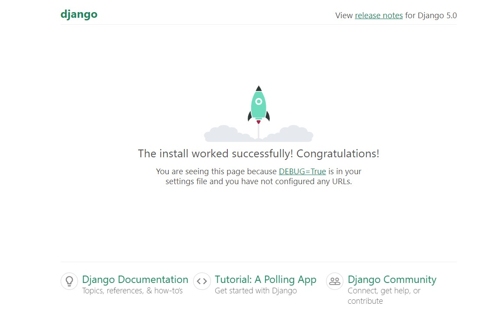

# Django Forms - Django Pizza Project

## Table of Contents
1. [Starting the Project](#starting-the-project)

## Starting the Project

### Step 1. Install virtualenv
```console
pip3 install virtualenv
```
### Step 2. Create Virtual Environmet
Make sure you are in the directory where you want to install the virtual environment before running the below code.
```console
virtualenv venv
```

### Step 3. Start the Virtual Environment
**For Windows**
```console
source venv/Scripts/activate
```

**For Mac**
```console
source venv/bin/activate
```
### Step 4. Install Django
```console
pip install django
```
### Step 5. Start Django Project
```console
django-admin startproject waynesgarden-project
```
**Move into the project folder**
```console
cd waynesgarden-prject
```
**Run the project**
```console
python manage.py runserver
```
Now when you visit: http://127.0.0.1:8000/ you should see that your page looks like the image below
